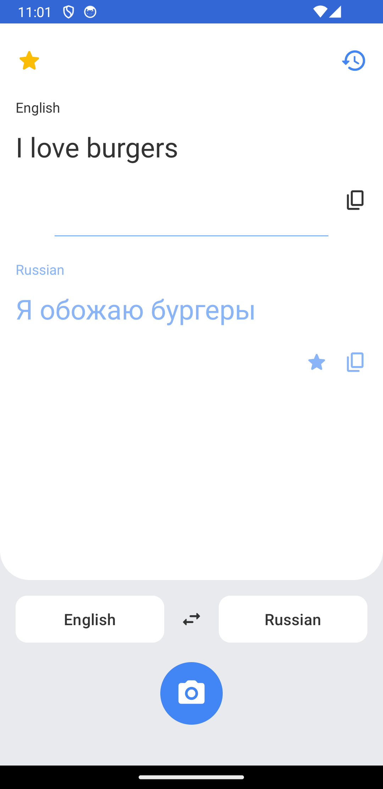
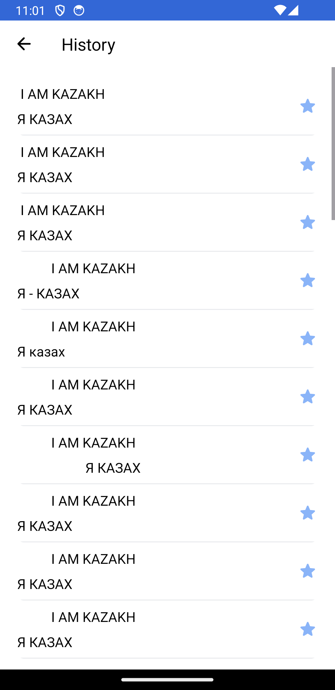
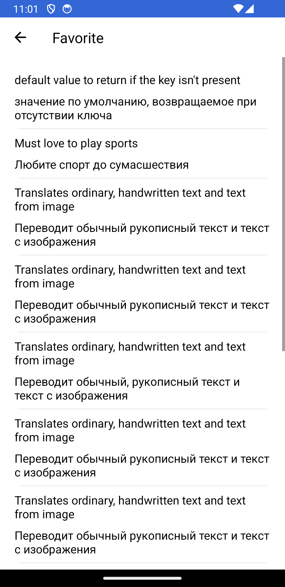
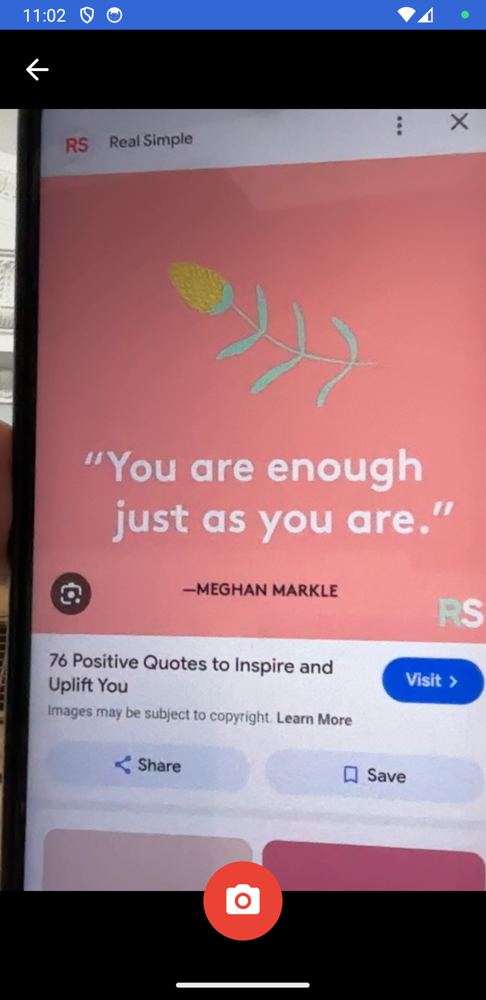
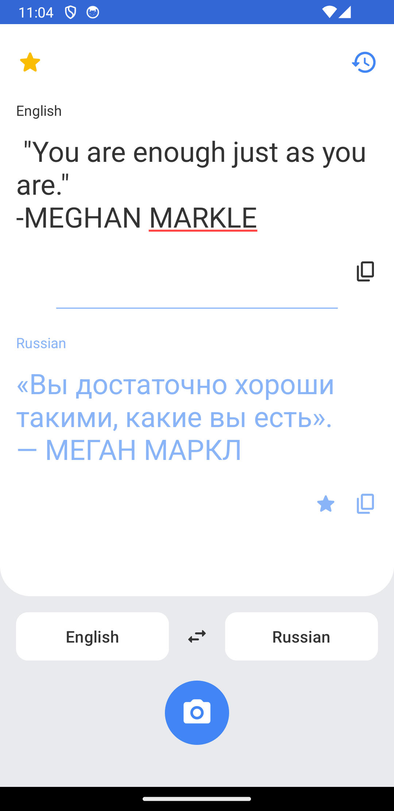

# Translator App

Translates ordinary, handwritten text and text from image.

## What we implemented

1. RecyclerView with diff.util implemented
2. Fragment Based Navigation with Single Activity
3. Third-party libraries (Camera2)
4. Network Requests (Gemini)
5. Implementation of MVVM pattern
6. SharedPreferences usage
7. Kotlin Coroutines

## More about Network

We used Gemini for translation that was written on backend. 
2 network requests was implemented by sending POST requests both from camera and EditText.
The 3rd request is GET request, that was used to implement history of translations.

# Android Final Project Team

Zhaxalykov Maksat, Abikhas Alikhan, Alishpanov Sultanmakhmud

# Usage

Before installing on android emulator run
``` 
docker run -e API_KEY=<YOUR_API_KEY> -d -p 8080:8080 skeercg/translator-api:0.0.2
```

# Screenshots of application

<p float="left">
  
   
  
  
  
</p>
